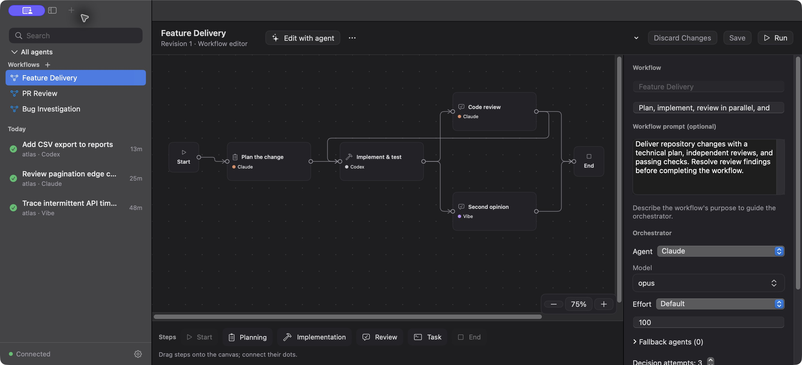

# Polybridge

**Build visual workflows across coding agent harnesses.**

Polybridge brings Claude Code, Codex, opencode, Mistral Vibe, and Antigravity into one workflow.
Draw the steps, choose a harness for each job, and let an orchestrator delegate the work.
Follow the graph, agent activity, and task checklist in the macOS Monitor—or run the same saved
workflow from an MCP client or the command line.



*The actual Monitor UI with illustrative workflow and task data. No live agent run is depicted.*

## Build once, run with the right agents

- **Design the workflow visually.** Connect Planning, Implementation, Review, and Task steps.
  Branch into parallel work, bring results back together, and route review findings into another pass.
- **Mix harnesses within one run.** Choose each step's model, effort, access level, session policy,
  and ordered fallback agents. Use the strengths of different agents without changing clients.
- **Let an agent refine your canvas.** Start with a graph or generate one from a prompt, then chat
  with a builder agent and inspect its proposed changes before applying them.
- **See what is happening.** Watch active nodes and agent activity, inspect execution history,
  and follow the technical plan and checklist as the run progresses.
- **Keep progress durable.** Polybridge saves workflow definitions, drafts, decisions, assignments,
  and results locally. Bounded retries and explicit recovery retain completed work.

For example, a feature workflow can use Claude to plan, Codex to implement, Claude and Vibe to
review independently in parallel, and Codex to run the final checks. Conditions on the arrows
explain when to move forward or return for fixes.

## How it works

The **orchestrator** owns your original request, workflow context, and checklist. It chooses among
valid next steps and writes a focused assignment for each worker.

**Worker nodes** receive their own instructions, the assignment, and relevant results. Planning
returns both a technical plan and tasks; implementation, review, and test steps return structured
results. A worker can ask the orchestrator for missing context, then continue its session.

**Polybridge** runs the harnesses, validates their final-message contracts, coordinates parallel
branches, and persists progress. Only the orchestrator updates checklist state. The agents keep
their own tools; internal workflow routing does not depend on agents calling Polybridge's MCP.

**Prefer orchestrator subagent** supports certified fresh, sequential, read-only Claude and Codex
workers. Other settings use Headless with an explanation; see the
[supported versions and restrictions](docs/workflows.md#native-subagent-execution).

When a run needs input, its caller supplies the answer. Monitor-started runs expose that interaction
in the app; MCP-started runs return it to the calling tool.

See [workflow mechanics, contracts, and recovery](docs/workflows.md) for the full model and diagrams.

## Get started

The runner supports **macOS and Linux with Python 3.11+**. The visual Monitor requires **macOS 14+**.
Install and sign in to at least one supported agent CLI separately; Polybridge uses the harnesses
already available on your machine.

```bash
git clone https://github.com/hainayanda/Polybridge.git
cd Polybridge
./install.sh
```

The installer installs `uv` if needed, installs Polybridge, and registers its MCP server with Claude
Desktop and supported agent CLIs it finds. Restart Claude Desktop after installation.

Build the macOS Monitor from the same checkout with **Swift 6.2+**:

```bash
./macos/build-app.sh
ditto 'macos/build/Polybridge Monitor.app' '/Applications/Polybridge Monitor.app'
open '/Applications/Polybridge Monitor.app'
```

In Monitor, click **+** beside **Workflows**, arrange the steps, select their harnesses, and connect
them. Save the workflow, then run it with a repository and a request. You can also use **Edit with
agent** to refine the graph and instructions.

Task detail titles wrap across the pane with the repository below and status/actions in a toolbar,
including standalone and embedded task views. Monitor offers Cancel for its own active workflows
and idle caller-owned workflows; linked child views route cancellation to the root.
See [workflow interaction and recovery](docs/workflows.md) for eligibility and cancellation outcomes.

History indexing recovers automatically while Monitor retains loaded content. New activity panels
fade into place, and actionable workflow loading errors appear in a dismissible top notification
with retained details. See [Monitor history and notifications](docs/workflows.md#monitor-history-and-notifications).

After updating your checkout, reinstall the CLI with `uv tool install . --force --no-cache` and
rebuild Monitor, then repeat the copy and open commands above so the installed app and runner stay in sync.

### Run a saved workflow

From an MCP client such as Claude Desktop:

> Use Polybridge's “Feature Delivery” workflow in `/path/to/repo` to add CSV export to reports.
> Wait for completion and summarize the results. If the workflow needs input, ask me and resume
> it with my answer.

“Feature Delivery” is an example name; create and save your workflow first.

The MCP tools are `start_workflow(name, prompt, repo_path)`, `get_workflow_status(workflow_run_id)`,
and `wait_for_workflow(workflow_run_id)`. You can also pass `workflow="Feature Delivery"` to
`start_task`. Workflow starts return a **`workflow_run_id`**, which uses workflow status tools.
Use `resume_workflow` to answer a suspended run, or `recover_workflow` with a reason for an eligible
failed run. Skipping an eligible refused optional reviewer requires the caller's explicit
`allow_optional_review_skip=true`; an ordinary answer grants no skip permission and revokes
prior skip consent at the same checkpoint. Each accepted answer supersedes that checkpoint's consent.
[Caller input and recovery details](docs/workflows.md#control-and-recovery).

From the terminal:

```bash
polybridge-ctl workflow-list
polybridge-ctl workflow-start 'Feature Delivery' --repo /path/to/repo \
  --prompt 'Add CSV export to reports' --json
polybridge-ctl workflow-status <workflow_run_id> --json
polybridge-ctl workflow-wait <workflow_run_id> --json
```

### Dispatch a single task

You can use the same bridge without a workflow. `start_task(prompt, repo_path, backend="codex")`
returns a **`task_id`** immediately. Follow it with `get_task_status` or `wait_for_task`, then use
`resume_task` for a follow-up. Independent tasks can run in parallel.

```bash
polybridge-ctl run --backend codex --repo . --prompt 'Review the pagination logic'
polybridge-ctl list
polybridge-ctl status <task_id>
```

## Supported harnesses

| Backend | CLI | Notes |
|---|---|---|
| `claude` | [Claude Code](https://docs.claude.com/en/docs/claude-code) | Turn limits, cost reporting, live messages |
| `codex` | [Codex CLI](https://github.com/openai/codex) | OS sandbox and network controls |
| `opencode` | [opencode](https://opencode.ai) | Cost reporting |
| `vibe` | [Mistral Vibe](https://github.com/mistralai/mistral-vibe) | Model selected in the harness configuration |
| `antigravity` | Google Antigravity CLI (`agy`) | Live messages |

Call `list_backends` to check installation and actual enforcement capabilities. Each harness needs
its own installation, authentication, and model access; Polybridge does not provide these accounts.

Before assigning a harness to a node, read [harness permissions and setup](docs/harness-permissions.md).
For refusals, missing tools or macOS Git cache diagnostics, follow the
[headless troubleshooting steps](docs/harness-permissions.md#troubleshooting-a-headless-refusal).
It covers all five harnesses, setup for each node type, build/test and MCP approvals, network access,
and common headless permission refusals.

## Access and local storage

| Access level | Intended scope |
|---|---|
| `read_only` | Inspect without editing |
| `write_in_repo` (task default) | Edit the repository |
| `publish` | Authorize remote publishing (commits, pushes, PRs, reviews); harness rules still apply |
| `unrestricted` | No restrictions added by Polybridge |

Enforcement differs by harness. Codex uses an OS sandbox; other harnesses use their own permission
systems. Inspect each task's `enforcement` report rather than assuming the level's name guarantees
isolation. Saved workflow node permissions are authoritative. GitHub operations use each harness's own tools
and user permission settings; Polybridge adds no GitHub-specific command approvals.

Definitions, drafts, tasks, and execution history live under `~/.polybridge/` and persist across
server restarts. Workflow and task data stay on your machine; harnesses send prompts to their
configured model providers.

## MCP setup

```bash
polybridge-setup --dry-run                 # Preview registration changes
polybridge-setup --client claude-desktop   # Register a specific client
polybridge-setup --status                  # Check client registration
polybridge-setup --uninstall               # Remove MCP registration
```

## Development

```bash
uv sync
uv run pytest                                          # No agent accounts required
PB_INTEGRATION=1 uv run pytest -m integration           # Real agent runs; may incur costs
PB_CLI_INTEGRATION=1 uv run pytest -m cli_integration   # Real CLIs with isolated configs
uv run mcp dev src/polybridge/server.py                 # MCP Inspector
```

For Monitor, run `swift test` in each package under `macos/`, then
`swiftformat macos && swiftlint lint` and `./macos/build-app.sh`.

Read [the workflow guide](docs/workflows.md) for definitions and execution contracts, and
[contributor notes](CLAUDE.md) for architecture and harness behavior.
