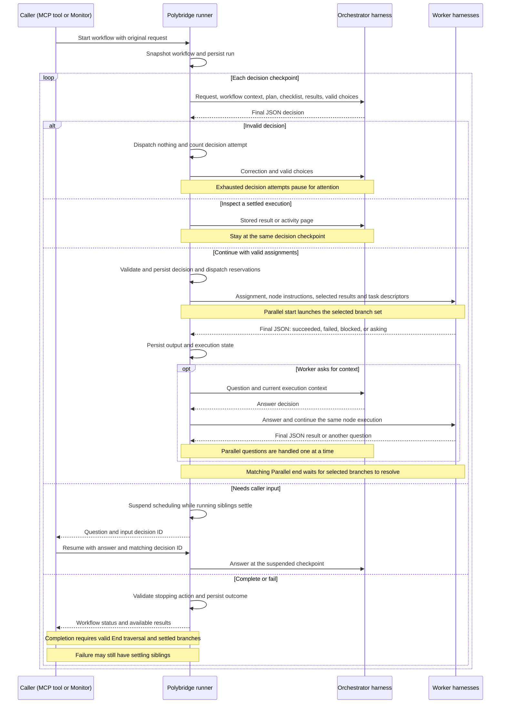
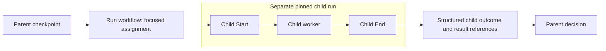
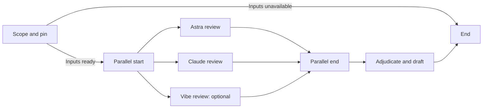
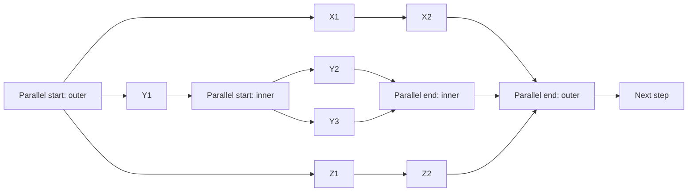

# Workflows

A workflow is a saved graph of independent agent steps. The orchestrator owns the original request,
workflow context, and checklist. At each stage it selects a valid continuation and writes a focused
assignment for the next agent. Polybridge validates, dispatches, and durably records the decision.
Conditions are instructions to the orchestrator, not code executed by Polybridge.

## Native subagent execution

New agent nodes default to **Prefer orchestrator subagent**. Previously saved nodes without an
execution preference retain **Headless** execution. **Prefer orchestrator subagent** asks Polybridge to
use a native child of the workflow's owning orchestrator when the harness and all requested node
settings are compatible. It does not adopt the interactive chat that started the workflow.
Unsupported combinations use headless execution before launch; the execution inspector records why.
A native preference cannot raise access, enable network, change models, or silently replace Resume
with Fresh. A missing native launch acknowledgement or an uncertain child outcome requires attention,
not a second headless worker.

Native executions have their own workflow execution identity and activity. The Monitor labels them
**Subagent**, links to the owning orchestrator, and shows the activity available from the harness.
Limited activity is labeled explicitly. Parent process liveness and a quiet activity stream do not
prove whether a child is running; the runner uses correlated harness lifecycle evidence.
A node advances only after confirmed child settlement and a valid structured worker result.

A subagent has no independent **Take over** action. Stop and Resume are available only when the
adapter supports those operations on that individual child. Parent takeover is refused while
children remain unresolved. Cancellation and timeout must settle the child before retry or fallback;
an unresolved child continues to protect its checkout even after its supervisor exits.

Scheduling policy is frozen from the complete pinned workflow dependency tree before its first
checkpoint. Trees with a native preference allow at most `max_parallel` workers plus one shared
parent/control turn; this policy remains in effect if preferred nodes fall back to headless.
The control allowance is shared across nested orchestrators, so native batches belonging to different
owning sessions serialize. Trees with no native preference retain their existing harness-turn limit.

Native support is certified per harness version and settings. Availability does not imply that every
role, permission level, session mode, model, or parallel configuration is supported. The runner
reports the actual execution mode rather than assuming that a preference was honored.

The initial adapter supports **Claude Code 2.1.290**, root sequential workflows, Fresh child
execution, `read_only` access, the exact inherited `claude-sonnet-4-6` model, and the
default 100-turn cap on both the parent turn and child profile. The child profile
permits Read, Glob, and Grep; it cannot run shell commands, edit files, or delegate further.
Effort overrides, other turn caps, child Resume, parallel/nested native execution and other Claude versions
use Headless with an explanation. Native implementation nodes therefore
remain Headless. The parent turn retains plan mode, applies a scoped setting disabling automatic
permission classification, and adds no tool approval allowlist.

The native CLI certification test uses an isolated localhost fake API with the real executable:
`PB_CLI_INTEGRATION=1 uv run pytest tests/test_claude_native_subagent_cli.py`. It makes no paid model
requests. This proves the tested CLI transport and permission behavior; it does not measure model
quality or guarantee that an arbitrary assignment will succeed.

The Codex adapter supports **Codex CLI 0.160.1**, root sequential workflows, Fresh child
execution, `read_only` access, and the exact inherited **gpt-6.1-sol** model. Both parent and
worker must omit effort overrides and turn caps; Codex does not support turn caps. Network
must remain blocked. The worker uses Codex's native tools under its inherited read-only
sandbox and approval policy. A pinned default-agent profile prevents ambient roles from
replacing its model, and a thread limit blocks further delegation. This matches Claude's workflow
behavior and access boundary, rather than its narrower Read/Glob/Grep tool set.

Codex child activity is **limited**: its exec JSON stream does not expose the child's complete
lifecycle or tool activity. After the owning control process exits successfully, Polybridge
verifies correlated parent and child session logs, the completed worker result, configuration,
and dispatch acknowledgement before advancing the workflow. Verified child runtime errors are
recorded as failed executions. Live child tool activity is not available. Missing, conflicting,
or oversized evidence requires attention without a duplicate
Headless dispatch. Child Resume, individual cancellation, takeover, write-capable workers,
parallel/nested execution, other models, and other CLI versions remain unsupported.

The Codex certification command is
`PB_CLI_INTEGRATION=1 uv run pytest tests/test_codex_native_subagent_cli.py`.
It uses the real pinned CLI with an isolated localhost fake API and makes no paid model calls.

opencode, Vibe, and Antigravity do not yet have native adapters; their nodes run Headless even
when Prefer orchestrator subagent is selected, with a visible fallback reason. Each additional
adapter needs verified launch, settlement, inherited settings, activity, and recovery behavior.

## How the runner works

Polybridge runs the control loop. The orchestrator decides what to do; worker harnesses execute
focused assignments and return structured results. The arrows below represent harness prompts
and final JSON messages—not MCP calls between agents.



Only the orchestrator owns the original request and global checklist. Planning can return two
separate outputs: task descriptors and a technical plan. Each planning node independently controls
whether either output is required. Polybridge stores supplied outputs, shows them in the Monitor,
and includes them in later orchestrator context. A worker receives only its assignment,
local guidance, and selected inputs. Harnesses can still use their own tools during execution.

The diagram shows the usual loop; fallbacks, retry budgets, optional branches, and failed-run
recovery follow the rules below. External callers answer their own input requests; Monitor-started
runs expose those questions to the user in the app.

Workflow names can include spaces, such as `Feature Implementation`. Names are stored exactly;
quote names with spaces when using the CLI. Names must start with a letter or digit and contain
1–100 letters, digits, spaces, dots, dashes, or underscores, without trailing spaces. Graph and
run identifiers retain their stricter format.

## Build and run

The macOS Monitor lists workflows in the sidebar, with a canvas editor and a run screen. Its Graph view
shows the canvas above the same agent activity columns used by Parallel. Parallel view expands
those columns. Highlighting comes from recorded task state. Agent names and colored dots identify
backends; vendor logos are unnecessary.

Task detail headers wrap the task title across the pane and show the repository beneath it.
Status and actions share a toolbar in the main window, standalone task window, and embedded workflow task view.

Task activity follows new messages automatically while you are at the bottom. Scrolling up pauses
following so you can read earlier messages; returning to the bottom resumes it.

The menu bar also shows workflow run status alongside agent activity. Its popover lists workflows
by name and status, including runs that need attention; selecting one opens that workflow run.

The canvas supports Start, Agent, End, Parallel start, and Parallel end nodes. Parallel boundaries
are structural steps: they have no harness, worker assignment, access setting, or agent attempt. Agent steps have four roles:

| Role | Purpose | Default access | Allowed access |
|---|---|---|---|
| Planning | Produce a task list for the run. | `read_only` | All four levels |
| Implementation | Implement work and report evidence. | `write_in_repo` | `write_in_repo`, `publish`, `unrestricted` |
| Review | Examine results and report issues or approval. | `read_only` | All four levels |
| Task | Perform a specific action, such as updating Jira. | `publish` | All four levels |

Planning defaults to requiring a nonempty `tasks` checklist and a nonempty Markdown
`technical_plan`. **Require checklist** (`require_tasks`) and **Require technical plan**
(`require_technical_plan`) are independent booleans; each defaults to true. A scoping brief may
disable either requirement. The Monitor right sidebar shows the technical plan alongside the live checklist.
Planning creates pending checklist entries. Workers can report progress, but **only validated
orchestrator decisions complete or reopen checklist items**. The Monitor shows that status without
a manual completion toggle.

Access levels are `read_only`, `write_in_repo`, `publish`, and `unrestricted`.
See [harness permissions and setup](harness-permissions.md) for all five harnesses and the additional
command, credential, network, and MCP setup needed for each node role.
Saved node access is authoritative for new runs; callers and assignment prompts cannot raise it.
Fallback candidates use that node's effective access. Historical runs retain their original launch
ceilings. Network is a separate optional setting, subject to backend capabilities.
Publish authorizes remote publishing when the assignment requests it, including PR creation,
reviews and comments. It does not itself grant credentials or bypass harness approval rules.
Polybridge owns runtime execution, not GitHub operations. Agents use their own tools under the
user's harness settings. Polybridge injects no GitHub command approvals or publishing guidance.

| Freedom | Claude | Codex | Vibe |
| --- | --- | --- | --- |
| Read only | Plan mode; explicit git commit/push denies; no command allowlist added | Read-only OS sandbox; network blocked; no per-command allowlist | Plan profile; no command allowlist added |
| Write in repo | Accept-edits mode; explicit git commit/push denies; no command allowlist added | Workspace-write sandbox; no per-command deny list; network off by default | Accept-edits profile; harness/user Bash rules control commands |
| Publish | Accept-edits mode plus git commit/push allow rules only | Workspace-write sandbox; network on by default; no per-command allowlist | Auto-approve profile, equivalent to Unrestricted |
| Unrestricted | Bypass-permissions mode; no command allowlist or denies added | Full-access mode; no command allowlist; network cannot be blocked by this sandbox | Auto-approve profile |

These are Polybridge's mechanisms, not an exhaustive list of commands that can run. Inherited
harness/user settings, credentials, sandbox policy and network determine actual tool access.
Claude's explicit denies win over inherited allow rules; at Publish, other commands still follow
user permission settings. Codex does not mechanically forbid commits at Write in repo, and Vibe's
Publish mode is broader than commit/push. Permission reports describe these differences; the bridge
does not claim identical confinement. Native harness approval refusals retain their reason,
while ordinary command stderr is not classified as an approval refusal.

Codex reports additional workspace writable roots inherited from its user configuration and
selected profile, with the configuration source. These are observed settings, not an OS receipt;
relative paths stay as configured and a subsequent config change can affect launch.
Codex Publish enables its workspace sandbox's network access; Write in repo keeps network off
by default unless explicitly requested. Vibe and Antigravity provide no narrower publishing mode:
Publish currently uses their unrestricted approval mechanism, as reported in access caveats.
Polybridge does not claim identical confinement across harnesses.

Write-capable tasks receive a private scratch directory through `PB_TASK_SCRATCH`, outside the
repository. Claude and Codex receive that exact directory as an additional writable root;
read-only tasks receive no scratch grant. Each worker's internal preamble also names its exact
absolute scratch path so it need not discover the environment variable. This context is hidden
from the assignment display. Directory access and Bash approval are separate: a writable root
does not approve arbitrary commands, change tool allowlists, or enable network access. No
persistent Configure scratch access control is added because it would duplicate the exact launch
grant or broaden access. Adapters without an explicit writable-directory extension cannot claim
such a grant merely from a supplied path; additional adapter launch support is outside this stage.
Artifacts stay with the task record for inspection and
recovery, and task retention deletes them without following symlinks. Large display assignments
are stored once in private full-prompt files; task metadata contains a bounded preview and an
explicit source reference. Detail reads verify and retrieve the complete assignment.
Large Codex, Vibe, OpenCode, and capped Claude prompts use stdin with immediate EOF rather than argv, so complete input
results do not exceed operating-system argument limits. Vibe trims outer whitespace on stdin;
Polybridge explicitly refuses large Vibe assignments with outer whitespace rather than altering them.

For example, a Task step that updates a Jira issue can request `"freedom": "publish"`.
The saved node access is authoritative for new runs. Callers cannot override it with
`--freedom` or assignment fields. A parent harness that cannot delegate the configured
access receives a refusal before dispatch. Historical runs retain their original access
ceilings. Set network separately where the backend supports it.

Each agent step configures its instructions, primary candidate, fallback candidates, access,
session mode, and attempt budget. The orchestrator has its own candidate list, saved with the
workflow and overrideable when launching. Workflow generation has a separate candidate list.

MCP tools expose definition list/get/save/delete, `workflow_builder`, run list/start/status/wait,
inspection, recovery, and pause/resume/cancel. The Monitor acts through matching `polybridge-ctl workflow-*` commands;
it never writes Polybridge state directly. Definition saves use an expected revision to reject
concurrent edits. Editing or deleting a definition does not change existing run snapshots.

MCP run start/status/wait/control responses use `response_version: 1` compact projections,
with a 24 KiB target: identity, status, progress, interaction ownership, actionable question
previews and recent decision errors. They omit the graph, assignments and full result history.
`list_workflow_runs(offset=0, limit=10)` returns `runs` and `next_offset`; use the latter to
continue listing. CLI run snapshots remain complete for the Monitor.

Read complete run content with `get_workflow_run_detail(workflow_run_id, view, cursor, limit)`.
Views include `executions`, `decisions`, `checklist`, `technical_plan`, `definition`,
`builder_draft`, `generated_definition`, `question`, `reason` and `wait_reason`. Builder status
also includes the authoritative `draft_revision`, so a builder can resolve preview conflicts
without fetching a complete graph in every status response.
Concatenate each response's `chunk` until `next_cursor` is null, then decode JSON. Each chunk
is bounded, including a single large result. Cursors bind the run, view and content hash;
if content changes, restart that view. Managed orchestrators can read their own run only;
execution results still require settled-only `inspect_workflow_node` rather than a detail shortcut.

`wait_for_workflow` defaults to 30 seconds and caps its effective hold at 45 seconds.
It accepts legacy requests up to 300 seconds but returns `requested_timeout_seconds`,
`effective_timeout_seconds`, `timed_out` and polling guidance. Repeat the wait while the run
is active; a long request does not guarantee one long-lived transport connection.

For example, load the supplied [implementation/review workflow](../examples/workflows/implement-review.json):

```bash
polybridge-ctl workflow-save implement-review \
  --definition examples/workflows/implement-review.json --expected-revision 0 --json
polybridge-ctl workflow-start implement-review --repo /absolute/path/to/repo \
  --prompt "Implement the requested change" --json
polybridge-ctl workflow-status <workflow_run_id> --json
polybridge-ctl workflow-pause <workflow_run_id> --json
polybridge-ctl workflow-resume <workflow_run_id> \
  --instructions "Address the reported failure" --additional-attempts 1 --json
polybridge-ctl workflow-resume <workflow_run_id> \
  --instructions-file /absolute/path/to/answer.txt --decision-id EXACT_DECISION_ID --json
```

Validate an editable graph before saving with
`polybridge-ctl workflow-validate --definition workflow.json --json`.
It returns `result.valid` and an optional `result.error` without saving definitions or run state.
Every node must be reachable from Start and have a forward path to End, including loops.

`workflow-list` and `workflow-list-runs` list definitions and runs. `workflow-get` reads a definition;
`workflow-delete` removes one. To generate a draft:

```bash
polybridge-ctl workflow-build my-workflow --repo /absolute/path/to/repo \
  --prompt "Plan, implement, review, then run tests" --backend codex \
  --fallbacks '[{"backend":"claude","model":"opus","reasoning_effort":"high"}]' --json
```

Definition JSON uses `nodes` and `connections`. An agent node's `role` is `planning`,
`implementation`, `review`, or `task`; its `agent.fallbacks` is an ordered array. `session_mode`
is `agent_decides`, `resume`, `fresh`, or `continue_previous` (default `agent_decides`). Connections specify `source`, `target`, `condition`, and an optional
`default` fallback. Definitions use `routing_mode: explicit`. A `parallel_start` and its
`parallel_end` share a stable `parallel_group_id`. Polybridge derives retry direction from
topology; callers do not configure a backward flag. Historical snapshots retain their original
routing interpreter. Legacy `join` nodes remain readable in historical records. Nodes store top-left canvas coordinates in `position: {x, y}`. Coordinates must be finite and nonnegative; the canvas expands automatically. Snapping uses a 10-point grid. Background dots are visual guides: their spacing adapts to zoom in multiples of that grid, keeping at least 20 points between dots on screen. Only visible dots are rendered, and their screen size stays constant. Agent nodes are 200 × 92 points (reserve 20 × 10 cells); Start and End are 72 × 72 points (reserve 8 × 8 cells). Builder agents are guided to leave at least 40 points between node edges and preserve existing positions exactly unless the user explicitly asks to move or rearrange nodes.

Each role receives built-in role guidance, custom step instructions, the orchestrator assignment,
and explicitly labeled input results. Workers do not receive the original request, full graph, or
global checklist. The immediate predecessor result is attached automatically; converging parallel
branches supply all incoming results. The orchestrator can reference older settled results and
assign specific checklist tasks without exposing global checklist status. Planning creates pending tasks, implementation reports task IDs
and evidence, review gives a verdict and concrete findings, and task steps report observed
results. Only the orchestrator changes checklist statuses. Select Start to edit workflow
settings, including the orchestrator, fallback agents, and limits.

## Run workflow nodes

A **Run workflow** node (`type: workflow`) references one saved definition by
`workflow_ref.workflow_id`. The stable identity survives edits; this release has no rename
operation. The inspector shows the referenced workflow and its access requirements. Invocation
settings include assignment guidance, attempts, timeout and optionality; harness, model, network,
access and worker session settings remain owned by the saved child definition. The root network policy can disable network across the tree; child network settings cannot re-enable it.

**Child orchestrator** is the default: the parent supplies a focused assignment that becomes the
child's request, and the child uses its own orchestrator, checklist and technical plan. **Current
orchestrator** reuses the nearest owning ancestor's session with serialized turns. Child decisions
and checklist items still belong to the child boundary. Neither mode flattens graphs or shares
worker sessions across workflows.



Save validates dependencies under the definitions-tree lock. Start pins the complete dependency
tree, including revisions and content hashes. Missing references, direct or indirect cycles and
more than four levels (root is level one) are rejected. Repeated references from separate branches
are valid. Later edits or deletion cannot change a pinned run. Deleting a referenced definition
reports `referenced_by`; new parent runs then require the missing dependency to be restored.

The root's `max_parallel` limits harness turns throughout the tree. Waiting invocations occupy no
harness slot. Children share checkout coordination and the root supervisor, while keeping linked
run records and immutable results. Full child results remain available through scoped descendant
inspection; bounded previews carry retrieval references and truncation information.

Child questions are forwarded to the original caller with their exact decision identity and
source. Concurrent questions are served in creation order. Answer the root's current decision ID;
its answer goes to that source checkpoint without repeating completed work or granting attempts.
Public child controls redirect callers to the root. Explicit attempt grants apply to the attention
source only. A child invocation timeout excludes idle suspension for caller input. Cancellation
and timeout follow persisted child invocation links and require settlement before redispatch.
Cancellation does not enumerate unrelated retained runs. Missing or mismatched child records
keep the affected ancestor unsettled until recovery establishes the child outcome.

Recovering a child preserves its existing work and attempt accounting; retrying an invocation
creates a new child and consumes an attempt. Permission, cancellation and uncertain outcomes
cannot be bypassed. Only settled child failures and settled timeouts are eligible for optional
bypass under the ordinary required-sibling rule; runtime failures are ineligible. Completing a
child never automatically completes parent checklist tasks. The parent orchestrator may explicitly
complete tasks assigned to a succeeded invocation using its child outcome as evidence.

Monitor opens each child in its own canvas with its assignment, checklist and plan, and a parent
breadcrumb. Sidebar groups follow persisted parent links; Current-mode checkpoints share the
owner's orchestrator conversation while decision history remains scoped. Takeover stays unavailable
while the root tree is active, suspended or settling. CTL JSON v5 supplies these links and states;
the backend and Monitor must be delivered together. Historical snapshots remain readable.

To author a reference, save a child, obtain its `workflow_id` from `workflow-get CHILD --json`,
and use this node in a parent's explicit-routing definition:

```json
{
  "id": "child-review",
  "type": "workflow",
  "workflow_ref": {"workflow_id": "ID_FROM_SAVED_CHILD"},
  "orchestrator_mode": "child",
  "instructions": "Review only the assigned change and report concrete findings",
  "max_attempts": 3
}
```

Start the parent in a temporary test repository. Open the node's child run, verify the assignment
and parent breadcrumb, then repeat with Current orchestrator. Use a parallel pair of Current-mode
invocations to check one shared session, and exercise a forwarded question and root cancellation.
Tests pin exact answer routing and recovery independently of model behavior.

## Branches and attempts

Outgoing connections on Start, agent nodes, and Parallel end are **exclusive alternatives**. The
orchestrator chooses exactly one valid connection, or asks for input/stops when no justified path
is available. Choosing multiple alternatives is a protocol error: Polybridge dispatches nothing
and requests a correction within the decision-attempt allowance.

Parallel start opens a group with **Branch selection** set to **All branches** by default. This
preserves the existing behavior: every forward branch runs. **Orchestrator selects** instead chooses
one or more applicable branch entries, using optional selection guidance and the request. The
orchestrator supplies a separate assignment for each selected executable entry and a reason
explaining selections and exclusions. The complete selection and assignments are validated before
any branch dispatches. Empty, duplicate, unknown, or downstream-node selections are invalid.

Selection is frozen per group invocation and persisted with its assignments and decision identity.
Restart and recovery use the same selected set; a loop re-entering Parallel start creates a new
invocation and can select differently. To skip the whole group, use an alternative incoming route.
Applicability selection does not make selected required work optional or relax failure-bypass
rules: selecting a branch with optional work requires an actually selected required sibling, and an optional-only selection is rejected before dispatch.

Outgoing arrow instructions describe branch purpose. Polybridge obtains focused assignments for
ready workers; structural traversal needs no assignment. `max_parallel` limits concurrent harness
turns across the workflow tree, so a group remains valid when branches execute one at a time.



Each branch may contain several steps and its own exclusive conditional routes. Every possible
forward route must reach the group's matching Parallel end. Sibling branches cannot overlap,
enter one another, escape the group, or reach workflow End before closing. Nested groups close
before their enclosing group; selecting either boundary in the canvas highlights its partner.



Parallel end waits for exactly its selected branches to resolve, combines their immutable result references,
and asks the orchestrator for the next continuation. An inner end can release while other outer
branches are still working. Arrivals are persisted by group generation and branch identity;
repeated arrival notifications cannot release a group twice. Required failures need recovery or
an explicit stopping/input decision; they cannot silently satisfy the barrier. A recovered branch
retains earlier failure evidence while its successful recovery resolves the barrier.

Monitor labels excluded branch regions **Not selected**, dims their connections, and shows each
group invocation's selected/excluded entries and recorded reason. This presentation is scoped to
the active or most recent enclosing invocation; a later loop can select a previously excluded
branch. It does not report exclusion as execution success or failure.

Definitions set `branch_selection: "all"|"orchestrator"` and optional `selection_guidance` on
`parallel_start` only. Durable group records retain `selected_connection_ids`,
`excluded_connection_ids`, `selection_reason`, `selection_decision_id`, selected assignments, and
the enclosing group identity; released history preserves them after convergence. Historical
records without selection fields keep their previous All branches behavior.

Retry loops may remain inside a branch, but cannot cross an open parallel boundary. Retrying a
whole closed group creates a new generation within the existing execution and transition budgets.
A retry arrow may share a step with forward alternatives, but selecting it remains exclusive.

Polybridge infers a retry when an arrow returns to a step that every path to its source passes
through. Canvas placement does not determine direction; ambiguous cycles are rejected.
Retry connections repeat a step. Workflow candidates default to a 100-turn cap where supported (Claude and Vibe).
Explicit limits are preserved; backends without turn-cap support, including Codex, do not
receive an unsupported cap.

Three attempts means the initial activation plus two repeats,
not three additional retries. New runs count this budget per graph visit: retries and malformed-output
corrections share a visit, while a later loop traversal starts a new visit. Loop limits remain
run-wide. Historical snapshots retain their original run-wide node budget. Defaults are three
activations per visit, 100 transitions per run, and four concurrently active node tasks. Read-only workflow steps share a checkout lease;
writing workflow steps require exclusive access. These leases coordinate workflow runs, not
manual edits or unrelated tools.

**Agent decides** lets the orchestrator choose Fresh, Resume, or Continue previous node for each assignment. Polybridge
issues compatible available session references in decision context. A Resume assignment names the
issued `resume_task_id`; arbitrary, busy, or incompatible sessions are rejected. **Fresh** starts
an independent conversation with only the assignment and selected input results. **Resume** keeps
an eligible candidate's prior conversation. Explicit node policies remain available. A different
fallback candidate starts fresh for a Fresh execution. When a selected Resume attempt encounters a
confirmed availability failure, Polybridge asks the orchestrator for an explicit Fresh decision
within the same node execution or clarification question. This happens automatically without asking
the caller for routine provider outages; Polybridge never silently replaces Resume with Fresh.
Unknown execution outcomes require reconciliation, and the orchestrator can still choose
`needs_input` when caller guidance is necessary.

For example, after a confirmed outage while resuming an asking worker, the orchestrator may answer
the same question with `session_mode: fresh`. Polybridge reconstructs the original assignment,
observed progress, and clarification history in the new session. For an ordinary node continuation,
the orchestrator selects the issued Fresh execution continuation with a new focused prompt. These
choices retain the activation identity and attempt history; they do not replay completed graph
steps.

**Continue previous node** (`continue_previous`) tries the session of the immediately preceding
serial agent execution, including its actual fallback candidate. Reuse requires one unambiguous
predecessor and compatible harness, model, effort, access, repository, and network settings.
Serial first entry never substitutes a historical predecessor session. On backward-edge loop
re-entry, Continue previous node uses the target node's own latest compatible settled session.
Retries use the selected execution's retained session. Convergence does not inherit a branch session. Incompatible or definitively unavailable predecessor sessions start Fresh; a
fallback candidate also starts Fresh. Retries retain their own execution session. The inspector
shows the actual mode and reason, including a specific backend, freedom, model, effort, or
network mismatch when reuse is unavailable. The orchestrator sees the same reason. Unknown or busy session outcomes require attention.

The inspector provides keyboard duration entry and a Seconds / Minutes / Hours selector.
Changing units preserves the limit; typed fractional durations round to the nearest whole second.

Agent nodes may set `timeout_seconds` to a positive integer; omitted, null, or zero disables it.
The deadline applies to each candidate execution. Expiry counts against the current visit's
attempt allowance. Polybridge cancels the task and its descendants, confirms settlement, and
records a timeout notice before using an ordered fallback. Unconfirmed cancellation pauses for
attention instead of starting overlapping work. The cancellation allowance includes SIGTERM
escalation and drain time. A recovered positively settled timeout still permits an unused fallback
in the same activation. Deadlines are persisted on each candidate reservation. Ordinary MCP
server restart does not stop the detached workflow supervisor; if that supervisor itself is lost,
surviving tasks require reconciliation and are not silently adopted or redispatched. A persisted
deadline provides diagnostics, not a watchdog that survives loss of the supervisor.

Planning nodes publish the latest complete technical-plan revision. Earlier versions remain in
immutable execution results for orchestrator inspection; a planning adjudicator that revises the
plan must return the full revised plan. Use a Task node for an arbitrary scoping/adjudication gate.
Review workers report `approved` or `changes_needed` when the review ran successfully; an inability
to perform the review uses worker `status: blocked` and does not require a review verdict. A custom
`pass`/`retry` gate may put that outcome in a Task result; the orchestrator still judges routing.

## Fallbacks

Fallback candidates are ordered and may include different backends or different models on the
same backend. Polybridge advances only after a confirmed availability failure: missing binary,
unavailable model, or a recognized quota/rate-limit rejection. Unsupported configuration is a
validation error. Failed tests, generic crashes, or an agent saying it is unavailable do
not automatically authorize a switch. An explicitly configured timeout permits a fallback only
after cancellation has confirmed settlement.

Each candidate is tried at most once within an activation. Switching candidate does not consume
an extra graph activation. The last working candidate remains selected for later activations;
unavailable candidates remain suppressed until explicitly retried. Every attempted candidate and
the switch reason are recorded.

Existing edits remain in place. Fallback waits for the previous process to settle and receives
known prior results. Ambiguous execution or side effects require attention. Exhausting the
candidate list also requires attention.

## Control and recovery

The detached supervisor continues when the Monitor closes or an MCP client disconnects. Pause
stops scheduling and lets active steps finish. Cancel stops the workflow's associated tasks and
their descendants. Taking over a managed task pauses workflow scheduling before handing the
session to Terminal; manual continuation is not silently adopted as the next workflow step.

At an attempt limit, the run stops scheduling, settles active siblings, and shows **Needs
attention**. Resume can include additional instructions and explicitly granted attempt budget.
Those grants belong to that run, not the saved definition.

Task associations are reserved before launch. Supervisor-crash recovery reconciles existing
records and does not automatically replay uncertain dispatches. Checkout leases recheck live or
uncertain orphan task associations after acquiring the OS lock, closing the gap where a supervisor
can die between the initial scan and lock acquisition. Active and Needs attention runs
protect their referenced task records from ordinary retention. Finished run history retains compact
outcomes; expired activity logs are shown as unavailable.

Native child activity logs follow `PB_RETENTION_DAYS` too, despite having no process task record.
Cleanup requires a fully settled workflow tree and both the execution's completion time and
the log's last write to be older than the retention period. Active, uncertain, or incompletely
recorded trees retain their evidence. Compact execution outcomes remain in workflow history.

## Delegation contracts and inspection

The orchestrator receives a durable decision ID, current stage, node responsibilities and access,
settled input results, checklist, recent decisions, and Polybridge-issued valid continuations.
Its JSON decision contains `decision_id`, `action`, and `reason`. Actions are `continue`,
`complete`, `failed`, `needs_input`, `inspect`, or `answer`. Continuing selects `continuation_id` entries and supplies
an assignment `prompt` for each agent execution, optional additional result references, and
optional assigned task IDs. Under Agent decides, each agent assignment also chooses
`session_mode: fresh|resume|continue_previous`; Resume identifies an issued `resume_task_id`. Structural traversal needs no assignment; convergence waits for the selected
branches before requesting one assignment for its next agent. Start always asks the
orchestrator for the first assignment. New runs retain one compatible native orchestrator session
across decisions, inspections, and worker questions. Each checkpoint still has its own durable
execution record and current authoritative context. A candidate change or a definitively missing
retained session boots Fresh; uncertain dispatch outcomes require reconciliation rather than
restarting the conversation or repeating work.

New runs avoid structural-only routing decisions. A continuation entering **Parallel start**
includes `branch_continuations`, `branch_selection`, and `selection_guidance`. The orchestrator
returns `branch_assignments`: every issued entry under All branches, or one or more selected
entries under Orchestrator selects. Selectable groups also require `selection_reason` explaining
selection and exclusions. Executable entries receive separately written assignments; structural
entries carry their own validated nested branch bundle. Branches can perform different jobs and
do not share a prompt. Polybridge validates the complete bundle before advancing or dispatching
anything, including nested groups. A single unconditional structural exit advances through normal
transition accounting. A successful worker with one unconditional path to End goes straight to
the completion decision, where the orchestrator still checks results and owns checklist updates.
Conditional paths, recovery, questions, and every new agent assignment still require judgment.
Parallel end already combines incoming results before one assignment decision for its next agent.

Decision examples are action-specific. New runs ignore unknown presentation fields and record
warnings alongside the accepted decision; empty assignment-reference fields on structural entries
are harmless. Invalid identities, continuation selections, required fields, nonempty misplaced
assignment context, and permission or harness overrides remain errors.

An agent continuation decision looks like this (IDs are issued by Polybridge):

```json
{
  "decision_id": "issued-decision-id",
  "action": "continue",
  "reason": "The plan is ready for review",
  "next": [{
    "continuation_id": "issued-continuation-id",
    "prompt": "Review the attached plan for missing cases and report concrete findings",
    "session_mode": "fresh"
  }]
}
```

For an Orchestrator selects split with issued iOS and Android branches, this selects only iOS:

```json
{
  "decision_id": "issued-decision-id",
  "action": "continue",
  "reason": "The request concerns the iOS implementation",
  "next": [{
    "continuation_id": "issued-parallel-start-id",
    "selection_reason": "Select iOS; exclude Android because it is outside the request",
    "branch_assignments": [{
      "continuation_id": "issued-ios-branch-id",
      "prompt": "Implement the requested iOS change and verify its affected tests",
      "session_mode": "fresh"
    }]
  }]
}
```

Launch metadata and runtime evidence come through each backend adapter. Claude initialization
reports its native model. Vibe's matching native session metadata can report `active_model`, the
resolved model name, and configured thinking level, with `harness_session_configuration`
provenance and `observed_configuration` status. This proves the session configuration, not the
provider's actual served identity. Missing native metadata remains unknown; assistant self-reports
never establish model identity.

Workers return `{status, result, evidence}`. Status is `succeeded`, `failed`, `blocked`, or `asking`;
role-specific results retain plans, completed task IDs, review verdicts, and observed test outcomes.
Planning nodes independently configure **Require checklist** (`require_tasks`) and
**Require technical plan** (`require_technical_plan`), both true by default. A review-scoping node
can disable both and return a focused brief. If a checklist is required but the worker judges
that no implementation tasks are appropriate, it returns `no_checklist_needed: true` and a
nonempty `checklist_reason` instead of inventing tasks. This is explicit evidence for the
orchestrator to assess when deciding whether to continue, retry, fail, or ask for input; it never
marks existing checklist items completed. Even with one unconditional exit, this proposal gets
an orchestrator decision: it may accept the brief or select an issued replan retry within the
node attempt budget. Polybridge never retries the planning worker automatically.
Omitted optional outputs preserve the previously stored
checklist and technical plan. A normal planning result looks like:

```json
{
  "status": "succeeded",
  "result": {
    "tasks": [{"id": "parser-validation", "title": "Validate empty input", "description": "Preserve the existing public behavior"}],
    "technical_plan": "## Approach\nValidate input before parsing.\n\n## Verification\nRun the existing parser tests and add an empty-input case."
  },
  "evidence": ["Inspected the parser and its tests"]
}
```

Polybridge preserves the complete technical plan and its source execution. The immediate successor
receives both the plan and checklist descriptors in the planning result; the orchestrator owns
checklist completion. The right sidebar shows the plan and live checklist for each workflow run.

A reviewer finding issues or a test step reporting failing tests can still execute successfully.
Polybridge accepts one unambiguous JSON contract surrounded by prose or a code fence. Conflicting
objects remain protocol failures, with the complete raw output retained. New runs accept a complete
result envelope followed by unrelated text or surplus formatting; a missing or malformed envelope
still fails the protocol. Historical run snapshots retain their recorded runner policy.
For guided runs, a malformed final envelope triggers a focused correction turn on the same
harness, resuming its retained session when available. The turn explains the validation error
and asks only for a corrected result, without repeating the work or changing permissions. Each
correction consumes a node attempt; the original output and errors remain inspectable. When
the budget is exhausted, required failures return to the orchestrator for recovery and safe
optional branches may converge with their failure evidence. The Monitor shows a collapsible
“Malformed output” activity cell. The orchestrator conversation displays the original request
once, then brief checkpoint descriptions for later turns; internal decision guidance stays hidden. Explicit caller grants can reopen settled protocol retries
without granting additional tool access. An `asking`
result contains `result.question` and optional `result.context`. The worker yields; the runner
persists the question and marks its execution `waiting_for_answer`, without treating it as a final
result. The orchestrator returns `answer` with the issued question ID and a focused answer prompt.
Polybridge resumes that same execution's conversation; repeated questions remain recorded until a
final result. Each node defaults to ten clarification questions (`max_context_questions`),
so repeated questioning cannot run indefinitely. Answering does not create an extra graph activation. Parallel workers may ask
independently; questions are serialized through the orchestrator while already-running siblings
settle. No shared convergence advances until its selected branches produce final outcomes.

For example, a worker can ask for missing context:

```json
{
  "status": "asking",
  "result": {"question": "Which API behavior should remain compatible?", "context": "Two existing clients differ"},
  "evidence": ["Inspected both client implementations"]
}
```

The clarification decision uses the issued decision and question IDs:

```json
{
  "decision_id": "issued-clarification-decision-id",
  "action": "answer",
  "question_id": "issued-question-id",
  "answer": "Preserve the existing public API; change only the internal implementation",
  "reason": "The caller requested a compatible refactor"
}
```

Invalid decisions dispatch nothing. Polybridge returns the error and valid choices, with three
total decision attempts by default (Start setting, range 1–10). This allowance resets after a valid
decision and is separate from node retries. In new runs, exhaustion pauses scheduling with
`needs_attention` and preserves the last decision error in `attention_reason`. The caller can
resume with a correction; extra execution attempts remain an explicit grant. Historical snapshots
keep their earlier exhaustion behavior. Inspection does not consume
a decision attempt. Each decision checkpoint has a bounded inspection allowance (default 20,
configurable 1–1000); repeated inspection cannot indefinitely postpone a decision. `needs_input` includes a question and suspends scheduling; running siblings settle,
and status reports whether settling remains. Resume rejects live or uncertain dispatches.

The orchestrator controls the runner through its final JSON response, not by calling Polybridge
control tools. For inspection it returns `action: inspect`, its `decision_id`, a `reason`, and a
`requests` array of `{execution_id, task_id?, view?, cursor?, limit?, before_seq?, after_seq?}`.
The runner validates and serves those requests, then gives their bounded results back to the same
decision point. Harness tools remain available for other authorized work; no Polybridge MCP call
is required for workflow routing, answering questions, or inspection.

The public `inspect_workflow_node(workflow_run_id, execution_id, ...)` tool remains available to
ordinary callers and can inspect any fully settled node
execution in that run, including older executions and fallback attempts. `execution_id` is the
activation ID in run state. Optional `task_id` selects a particular candidate attempt. The result
view returns JSON text chunks with `chunk`, `next_cursor`, and `has_more`; concatenate the chunks
and decode JSON to read full `node_result` and `raw_output`. Pass `next_cursor` as `cursor` until it
is null. Result pages default to 16,000 characters and cap at 32,000. Cursors are bound to the run,
execution, selected attempt, and immutable content. The activity view uses normalized task events
with `before_seq`/`after_seq` pagination (50 events by default, maximum 200).

Managed orchestrators can read only their own run and settled node executions. Workers can read
only tasks from their own execution; workflow context reads are refused. Ordinary callers keep
existing read access. These are API boundaries, not filesystem isolation.

```bash
polybridge-ctl workflow-inspect RUN_ID EXECUTION_ID --view result --json
polybridge-ctl workflow-inspect RUN_ID EXECUTION_ID --task-id TASK_ID --view activity --json
polybridge-ctl workflow-recover RUN_ID --reason "Inspected and resolved the outage" --json
polybridge-ctl workflow-recover RUN_ID --reason-file /absolute/path/to/recovery.txt --json
polybridge-ctl workflow-migrate --json
```

For large control text, `workflow-resume --instructions-file` and `workflow-recover --reason-file`
read a UTF-8 file without placing its contents on the command argument vector. These flags are
mutually exclusive with `--instructions` and `--reason`, respectively. File transport preserves
CRLF, newlines, Unicode, and leading/trailing whitespace without trimming. Unreadable or invalid
UTF-8 files fail before dispatch. Recovery still requires a reason; resume instructions remain
optional. The same ownership, decision-ID, and explicit attempt-grant rules apply.

Interaction ownership is recorded when the run starts. MCP and ordinary CLI starts belong to the
**caller**: `needs_input` returns the question to that caller, and the Monitor shows the question
without offering an answer/control composer. Human Monitor starts use CLI `--monitor`; their
questions are answered through the Monitor. Caller-owned controls cannot impersonate Monitor
controls, and Monitor controls cannot resume, recover, or pause caller-owned runs. Explicit cancel
is separate from that ownership: Monitor-started root runs offer Cancel while active or idle.
Caller-owned root runs offer Cancel only at an idle paused, input, attention, or stuck checkpoint,
with no active or unresolved tasks or nested workflow execution. The runner checks eligibility
again when the request arrives; stale views are refused without taking over caller interaction.
An unverifiable supervisor identity also prevents cancellation. Descendant eligibility checks use
bounded record sizes, a shared metadata budget, and run-count/nesting limits; if the complete tree
cannot be verified within those limits, Cancel remains unavailable with an explanation.
The workflow header keeps the refusal reason visible, including guidance for inspecting known runs.
Cancel cascades through linked children and their tasks. Child views offer **Open root to cancel**
so the scope is clear. While cancellation settles, the Monitor shows **Cancelling**; errors remain
visible and the run is refreshed. If a task owner is still settling a cascaded descendant, the
workflow records `needs_attention` rather than reporting cancellation complete.
Monitor terminal continuation is offered only after the workflow
has completed its valid End traversal, never while a node is still participating in execution.

Resume of `needs_input` includes the exact published `input_decision_id` as `decision_id` (CLI
`--decision-id`) and the answer in `instructions`, preventing stale answers from being applied to a
later question. Monitor CLI controls also include `--monitor`. The caller's original request
remains the workflow prompt; answer prompts are stored separately for their individual task attempts.

If a supervisor encounters an exception while cancelling, Polybridge makes a bounded attempt to
settle its active dispatches, then records `needs_attention` with the cancellation error. It does
not repeatedly relaunch the failed cancellation supervisor. Existing task records remain
available for reconciliation; uncertain dispatches cannot be resumed or repeated.

Explicit `recover_workflow` requires a nonempty reason and a failed, settled run. It returns the
failed decision to the orchestrator with a fresh decision allowance and preserves completed work.

For a settled permission refusal in an optional review node, answer the current question with
`resume_workflow`, its exact `decision_id`, and nonempty `instructions`. To authorize proceeding
without that reviewer, also pass `allow_optional_review_skip=true` (CLI
`--allow-optional-review-skip`). The default is false: a normal answer, including a negative answer,
does not authorize a skip. Do not set the flag unless the caller explicitly agrees to proceed
without the reviewer. If the orchestrator asks again at the same checkpoint, the latest accepted
answer supersedes its earlier consent: false revokes previous skip grants there, while true renews
them with the latest reason. Grants for other checkpoints are preserved. Forwarded answers apply
this replacement at the originating child checkpoint, and retrying the same delivered answer is
idempotent. In a Monitor-owned run, the separate **Proceed without optional reviewer**
button makes that choice; ordinary **Resume** does not. The availability indicator is only a hint:
Polybridge rechecks eligibility and the current decision when accepting the request.

```bash
polybridge-ctl workflow-resume RUN_ID --decision-id CURRENT_DECISION_ID \
  --instructions 'Proceed without this reviewer; reconcile the available reviews.' \
  --allow-optional-review-skip --json
```

The orchestrator may then select the issued `skip_optional_review` continuation.
This requires an active safe parallel convergence with a required sibling. The skip also discards
settled protocol failures in that execution's own repair chain, retaining their evidence. It preserves
the failed result and forwards the denied tool/command with its task identity and the caller's and
orchestrator's skip reasons to final review. It does not approve the reviewer, retry denied
tools, grant attempts, or change saved permissions. Required reviewers, child workflows, authority
blocks, cancelled work, and unknown outcomes cannot use this route. The caller answer alone does
not skip anything: the orchestrator records its explicit decision and reason. For a question
forwarded from a child run, the opt-in follows the exact answer to that source checkpoint;
it authorizes no other reviewer or child invocation.

Decision exhaustion in new runs uses `needs_attention`, so use `resume_workflow` rather than
failed-run recovery. The last contract correction remains visible. Resuming renews the decision
allowance; `additional_attempts` grants execution/retry capacity only when explicitly requested.
A verified answer to the current `needs_input` can reopen its referenced settled worker when
the worker deliberately stopped for a caller decision, including an `authority`-labelled decision.
The harness must have completed without permission denials, errors, or an unknown outcome.
The answer is attached verbatim to the retry assignment; it does not grant tools or extra attempts.
An available node attempt is required; exhausted budgets need an explicit `additional_attempts` grant.
Permission-caused blocks retain their existing recovery rules. Explicit grants can also reopen
eligible missing-context blocks at End, within the granted budget. Its assignment includes the answer;
completed nodes are not replayed and saved access cannot be raised.
Already-running siblings finish and persist their results while scheduling is suspended. The
Monitor shows **Settling** until they finish and refuses premature resume or session takeover.
Extra execution/retry grants require `additional_attempts`; completed and cancelled runs cannot
recover. Caller answers and override reasons are passed back into orchestrator context.

This feature is unreleased. Conversion backs up and revision-checks saved definitions before
inserting explicit parallel boundaries around confirmed parallel regions. Original node IDs,
settings, positions, and arrow IDs are preserved; selected branch arrows and arrivals are rewired
through the new boundaries. Conditional alternatives remain outside the group. Ambiguous groups
require an explicit conversion choice rather than guessing from outgoing arrow count. Eligibility
checks previously used to omit an optional branch must move into that worker's instructions: an
ineligible worker reports blocked without performing the restricted work. This policy change must
be reviewed together with the converted definition. Conversion does not change session modes.
Historical records retain their execution snapshots. Active runs must settle or be explicitly
cancelled before cutover; migration does not cancel them automatically.

## Storage and permissions

Definitions live under `~/.polybridge/workflows/`. Immutable run snapshots, task associations,
decisions, and control history live under `~/.polybridge/workflow-runs/`. Ordinary agent streams
remain under `~/.polybridge/tasks/` and use the existing event format.

The orchestrator recommends decisions; it cannot grant additional node permissions. Builder and
orchestrator agents run read-only, and workers retain the run's permission limits. Existing backend
enforcement caveats still apply: a workflow does not create an OS sandbox for a backend that lacks
one. Inspect each task's enforcement report.

## Unsaved editor drafts

The Monitor automatically keeps unsaved canvas edits as local drafts, including incomplete graphs and applied agent proposals. Navigating away or reopening the app restores the draft. Drafts retain the original saved revision, so Save still detects another update to the saved workflow. Only an explicit successful Save changes the runnable definition. Save is disabled when the canvas matches the saved workflow.

A workflow editor draft also remembers its builder conversation. Navigating to another task and back reconnects to the same running agent or completed proposal. Applying the proposal or explicitly returning to the canvas dismisses that conversation from the editor. Workflow-builder activity has no terminal takeover button.

New canvases start with Start → Plan → Implementation → Review → End in an evenly spaced row. Review also has a retry path back to Implementation when changes are needed.

With the canvas focused, use ⌘C and ⌘V to copy and paste selected nodes. Pasted nodes get new IDs and an offset; connections within the selected group are copied. Existing Start/End nodes are skipped so terminal nodes stay unique. Text fields retain their normal copy/paste behavior.

With the canvas focused, press ⌘Z repeatedly to undo earlier edits. A full node drag is one undo step. Text fields retain their normal text undo. **Discard Changes**, beside Save, restores the saved workflow (or the starter for a new workflow) and clears its unsaved draft. Discard and canvas undo are unavailable while an agent is editing.

## Edit the current canvas with an agent

Choose **Edit with agent** in the editor to refine the currently placed steps, including unsaved
changes. Describe the changes and select a repository for read-only context. The builder can read
repository instructions and available skills. Its activity uses the existing workflow run screen.
Choose **Apply proposal** after completion, then explicitly **Save** to persist the result. **Return
to canvas** keeps the original draft; failed refinement does not replace it. If the source canvas
changed, applying is refused so newer edits remain intact. Historical proposals retain the original
saved baseline and revision, so Save still detects concurrent updates.

CLI callers can pass a current canvas file (it may be incomplete) and optional saved metadata:

```sh
polybridge-ctl workflow-build my-workflow --repo /absolute/path/to/repo \
  --prompt "Add a review step" --backend codex --definition canvas.json \
  --source '{"name":"my-workflow","revision":3,"saved_definition":{}}' --json
```

`workflow_builder` accepts the equivalent optional `definition` object and `source` object.
Refinement returns a run ID; its validated `generated_definition` is an unsaved proposal in the run
record. It never overwrites the stored workflow. Existing generation without `definition` retains
its create-draft behavior.

Builder activity appears as a regular agent conversation beside the canvas. Each accepted
`apply_workflow_draft` update previews the placed steps while the agent works; these revisions
are separate from saved workflow revisions and never write the saved definition. The builder
receives its current draft revision and publishes updates with `expected_draft_revision`.
Only the verified active builder task can publish a preview. Render-safe previews accept
Fresh, Resume, and Agent decides sessions and validate both planning output flags. An idle live
builder reads pending feedback without rewriting run state; state is persisted when feedback is
actually claimed or delivered.

Chat uses the same task composer. Messages join the current turn when supported, or queue for
the next builder turn in the same run and conversation. CLI callers use:

```sh
polybridge-ctl workflow-builder-followup RUN_ID --prompt "Add tests after implementation" --json
```

The builder can publish a preview through MCP `apply_workflow_draft(definition,
expected_draft_revision)` or `workflow-builder-apply --definition draft.json
--expected-draft-revision N --json`. This action derives the run from the verified caller;
it accepts no caller-supplied run or task identity. Final proposals still require explicit Apply
and Save in the editor.

## Limit an inferred retry arrow

Select an arrow returning to an earlier step, enable **Limit retries**, and choose **Max retries**.
The optional connection field `max_retries` counts committed traversals of that arrow across the
entire run; zero disables the retry. Omitting it keeps existing behavior. Node attempt and workflow
limits still apply. A configured limit remains on the connection during topology edits and applies
only when the connection is inferred as a retry.

When a run exhausts an arrow's limit, inspect the result and choose **Continue with one more retry**
to grant one additional traversal to the exhausted path. This explicit continuation preserves your
instructions and does not change the saved workflow's limit. The workflow validator returns its
canonical definition so the inspector uses engine-inferred retry metadata rather than stale flags.

Creating or editing a workflow does not require a repository. Omit `--repo` from
`workflow-build` (or omit `repo_path` from `workflow_builder`) to use Polybridge's
private `~/.polybridge/builder-workspace`. The builder remains read-only, and
followups reuse that workspace. Supply a repository when the builder needs its
instructions or skills; supplied paths still receive the normal repository
validation. Running a workflow still requires a repository.

Node prompt descriptions, initial activity bubbles, and Prompt tabs show the exact orchestrator
assignment for that execution, including distinct assignments on retries. The overall workflow
continues to show the caller's original request. Internal role guidance, input payloads, and protocol
instructions are stored separately from that display projection. Raw diagnostic backend logs may
contain the complete execution payload.

### Harness-global MCP approvals

Settings → Harnesses → MCP approvals lists native global approval rules for each harness.
Use `server/tool` for an individual MCP tool or `server/*` for a server-wide rule.
Vibe requires individual tool entries. Adding or removing a rule requires explicit confirmation;
Polybridge does not approve tools automatically after an agent error. The recovery action offers
approval for Polybridge tools and does not restart or resume the agent automatically.

The CLI equivalent is `polybridge-ctl mcp-allowlist --backend codex --json`, with
`--allow polybridge/apply_workflow_draft` or `--remove polybridge/apply_workflow_draft`.
Rules are written to the harness's native global configuration, with a private backup of the
previous file. Harness deny/ask rules, agent profiles and project configuration may still take
precedence. New sessions load updated configuration. Removing an approval restores the harness's
fallback policy rather than restoring a previous explicit per-tool policy.

Start steps may contain an optional `prompt` describing the workflow's purpose.
Polybridge includes that purpose in orchestrator decision context alongside the
request supplied when running the workflow. It complements the runtime request;
the overall workflow shows that request, while each node shows its orchestrator assignment.

A candidate can also fall back when Polybridge positively refuses a harness capability before
starting its process, such as an unsupported turn cap or reasoning control. An unsupported primary
configuration is accepted only when an ordered fallback exists. Each fallback keeps the same
effective access and network limits. Security lineage refusals, repository/session problems,
ordinary permission denials, and failed checks require attention rather than bypassing restrictions.

Ordered fallbacks also cover authoritative provider outages: failed harness API/transport
diagnostics or typed provider errors identifying server failures, overload, or connection failures.
Silence, assistant/tool claims, and ordinary test failures do not trigger fallback.

Agent nodes may set `optional: true` (default `false`) to tolerate a definitive failure inside an
active parallel branch. The step still runs and tries its configured fallbacks. If it fails, its
branch arrives at the current convergence with explicit failure evidence; a required sibling must
belong to the group. An optional step cannot bypass required steps before that Parallel end.
Sequential optional nodes and forks containing only optional branches are rejected. Selecting an
optional path alone does not grant failure tolerance. Unknown outcomes, cancellation, failures caused
by security or enforcement refusals, repository/session problems, and workflow limits still require attention.
A positively settled timeout may bypass an optional branch even if earlier tool calls were denied;
the timeout and all permission denials remain in its failure evidence. A failure or block caused by
a permission refusal remains ineligible. In guided runs, a settled malformed-output protocol failure
can also converge after its correction attempts are exhausted, retaining the raw output and any
incidental denials as evidence; it does not authorize denied tools. Parallel-end arrivals are offered only when their required
failure evidence is resolved; otherwise the orchestrator receives the blocker and available recovery
choices. Reloading and resuming an older paused run rechecks this eligibility.
Unsupported model, turn, or reasoning settings count as unavailable candidates after fallbacks.

### Explicit retries and task navigation

A safely settled failed or blocked worker can expose a `retry_execution` continuation
while its branch remains at that decision point and its node has attempts remaining.
The orchestrator supplies a corrected assignment and an allowed session choice. This
consumes a node attempt without traversing a graph edge or repeating completed siblings.
Protocol failures, permission failures, cancellation and uncertain dispatches do not
silently retry. Structural continuations accept only their continuation ID; session
fields belong to executable assignments.

Polybridge records requested and effective harness settings separately from observed
runtime identity. Workers do not need to certify a model or effort they cannot inspect.
Only a returned review verdict counts as a review; a blocked result is evidence of a
blocker, not an approval.

The sidebar groups workflow and parallel executions under expandable parents. Opening
a child from the overview selects its full task details. Resumed turns share a child only
when they belong to the same harness session; fresh sessions stay separate, including
orchestrator sessions. The overview focuses on live
activity; full decoded results remain in individual task details. Workflow tasks cannot
be taken over while their parent run is active, suspended or still settling.

### Recordless dispatch reconciliation

Reservations record whether Polybridge is still preparing or has requested a spawn. A restart
can settle a recordless preparing reservation as not started. Once spawning was requested,
missing records remain uncertain: they never expire automatically or permit redispatch.
Known exec failures before a process exists are recorded as not started.

After independently confirming that no process survived, a human can release a named
recordless reservation with:

```sh
polybridge-ctl workflow-abandon-dispatch RUN_ID EXECUTION_ID TASK_ID \
  --reason "Confirmed the process is stopped" --confirm-no-process
```

The command refuses agent callers, live or uncertain supervisors, recorded tasks and unrelated
reservations. It persists the confirmation and reason without scheduling work or granting
attempts. Resume or recovery remains a separate explicit action.


### Monitor polling and complete detail retrieval

The ctl JSON contract is version 7; this version adds Monitor cancellation eligibility and refusal
metadata. The matching Monitor accepts versions 1–7. Reinstall the CLI and rebuild the app together.

Monitor polls `workflow-status RUN_ID --monitor-view --json` for bounded metadata and content
digests. On initial loading, it captures one coherent transport snapshot using
`workflow-status RUN_ID --monitor-view --snapshot --json`. Subsequent `--cursor CURSOR` calls
read the same immutable snapshot in bounded 128 KiB JSON chunks, so a running workflow cannot
invalidate an in-progress load. Completed paging deletes its temporary snapshot; abandoned
snapshots expire after five minutes. These files do not update saved workflows or run records.

The window coordinator retains the last loaded content for up to eight runs. Reopening a run
shows that content immediately while refreshing; a failed refresh preserves it. Unchanged polls
transfer metadata only. Changed fields use `workflow-detail RUN_ID --view VIEW --monitor-view
--json`; only changed executions are fetched when the execution index changes. This local
transport captures the requested view once and serves immutable 128 KiB continuation chunks.
Each continuation reads a bounded receipt, seeks the requested page, and verifies file identity
and page integrity without rereading or hashing the whole cached view. Receipts bind the run,
view, digest and immutable file anchors. Native loading checks the advertised content digest
before merging a changed view and retries a stale view once.

`workflow-detail RUN_ID --view VIEW --cursor CURSOR --json` remains available for lossless
individual views, including definitions, checklists, plans and execution history. Its content-bound
cursors still require restarting when their view changes. Ordinary `workflow-status` retains its
full response contract. Snapshot transport is a local Monitor-only CLI operation: managed agents
cannot use it to bypass settled-node inspection or access another run.

### Bounded task, execution and activity history

Monitor loads recent task and workflow headers in pages of 100, separately from live active
updates. **Load more** requests one older page; ordinary refreshes merge by stable identity and
retain loaded pages. Direct ID lookup can reveal an execution outside the loaded page, including
its ancestor and orchestrator session-owner headers. Root-tree totals do not depend on which
historical page is visible. Loading, indexing, retry and end states remain explicit.

`task-list-page` and `workflow-list-page` use opaque chronology cursors rather than shifting
array offsets. Existing listing callers retain their original interfaces. A compact local catalog
stores bounded headers; modern record writes maintain it. Legacy records are indexed in bounded
batches without rewriting them. During bootstrap, recent history remains explicitly indexing
until its chronological ordering is known. Filename discovery still examines directory entries;
it does not decode the entire historical collection in one request.

Activity initially reads the newest 100 events and tails new events from that boundary.
**Load more** reads one older byte window, with a 1 MiB scan ceiling and the existing response
byte ceilings. Cursors bind file identity and snapshot integrity; replacement or truncation
requires a fresh generation. Loaded pages retain tool-call/result pairing across boundaries and
preserve the scroll anchor when older events prepend. Deliberate selection or filter changes
reset paging. `get_task_event_page` exposes the bounded cursor reader to MCP callers; existing
sequence-based `get_task_events` remains compatible. Sparse filters or malformed large records
can yield an empty page with a continuation, so callers must use `has_more`, not page length.

Cumulative summary accounting is independent of the loaded activity window. Background scans
process bounded chunks and retain compact counts and edit identities instead of raw history.
Unloaded conversation members and unfinished summary bootstrap are labelled incomplete.
These bounds address large-history loading; they do not establish the cause of the reported
intermittent Monitor stall. The remaining observations and investigation are recorded in
[stall investigation](drafts/monitor-performance-feedback.md).

Legacy catalog loads cap each metadata file at 4 MiB and each catalog load batch at 8 MiB.
Workflow header paging and ancestor expansion have separate bounded batches (at most 16 MiB
combined), rather than implying an 8 MiB ceiling for the entire endpoint. A file beyond the
ceiling becomes an explicit unknown header requiring direct inspection; loaded known history
remains available with incomplete chronology and count indicators. If an oversized task record
prevents proving caller authority, paged APIs fail closed with `authority_incomplete`, expose no
new IDs, and explain the existing direct-status inspection route. Direct full detail interfaces
retain their prior behavior and can populate the derivative index without rewriting the record.
Private cached caller identity projections are limited to 8 KiB, preserve required markers
without truncation, and fail closed when identity cannot be represented. Ownership receipts
are capped at 16 KiB; legacy ownership decoration shares one bounded workflow catalog batch
across the page. A read-only inventory found all existing task metadata below 12 KiB and all workflow records
below 4 MiB when the limits were selected.

Task pages reconcile at most 100 requested and 100 rotating indexed active process identities,
so unloaded active records can settle without fetching historical pages or replaying streams.
Uncertain or dead-but-unreconciled outcomes stay explicit; verified process death does not prove
a failed harness result. Finish notifications wait for the reconciled outcome. Counts remain
unknown until the relevant identities have been checked, and transient indexing preserves the
last verified totals.
